Some documentation for the installation of ioBroker and the connection to HA

# ioBroker installation

install ioBroker 
* if you have proxmox, use proxmox script https://tteck.github.io/Proxmox/#iobroker-lxc
* manual install on linux: curl -sLf https://iobroker.net/install.sh | bash -
* or find more info here https://www.iobroker.net/#en/download

after installation you need to go to IPaddress and port :8081

after Welcome screen go through the authentication and other customization.

Finally you will see:

go to the config page of adapter

click Finish!

You may want to let IOB discover your home and ask for installation of some matching adapters.
you can skip it by directly hitting 'Close'.

# ecoflow-mqtt adapter installation

you should start with "Adapters" in the side bar

in search field type ecoflow

a card appears and click on the 3 dots

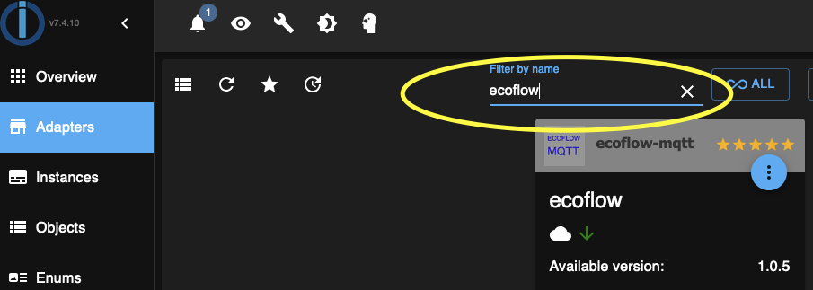

the click the + to install the adapter and add an instance

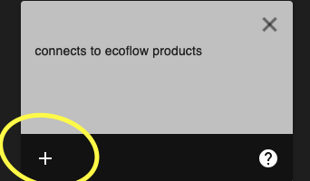

after the installation the process opens directly the admin page of the adapter

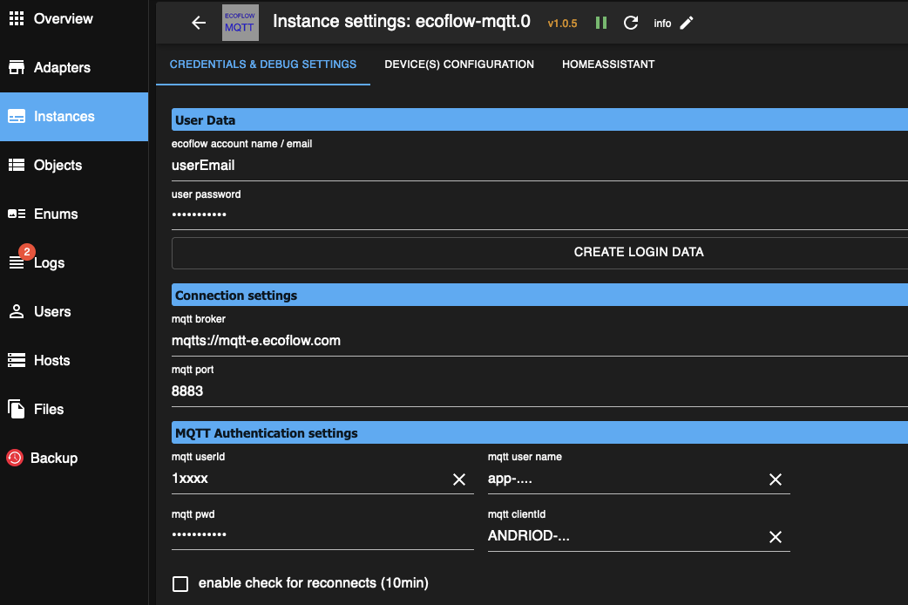

You need to complete the 3 the tabs
* CREDENTIALS & DEBUG SETTINGS -> access to EF MQTT server
* DEVICE(S) CONFIGURATION -> your devices type and serial number
* HOMEASSISTANT -> access to HA MQTT server

SAVE AND CLOSE will start the adapter, or restart it.

# Ecoflow settings

You need to get the credentials to access the EF MQTT server
You have 3 possibilities:
1. by script https://github.com/mmiller7/ecoflow-withoutflow/blob/main/cloud-mqtt/ecoflow_get_mqtt_login.sh
2. by website https://energychain.github.io/site_ecoflow_mqtt_credentials/
3. by adapters own alogorithm (pressing the button), for this the ecoflow username and password is necessary.

using the third method transfers the credentials directly to the "MQTT athentication section"

Otherwise you have to copy and paste the values to the fields.
* mqtt userId (your email address transferred to an Id, last portion of the mqtt clientId) e.g. 151.......
* mqtt user name (MQTT User) starts with "app-".
* mqtt pwd (MQTT Password)
* mqtt clientId (MQTT Client ID (sample)) i.e. ANDROID_666498788_1....

# Device configurations

There are multiple chapters for the different devices.

Select your devices i.e. Delta 2 powerstation with the Serial# R331ZEB4ZEAL0528 and enable  HA gateway.
The you should add a new line with + and it should look like:

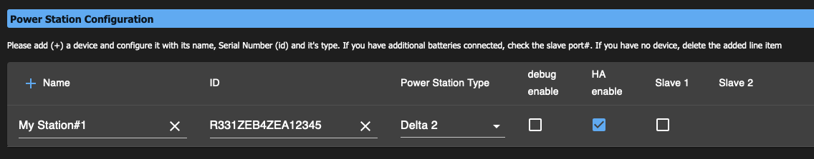

# HA settings
Enable the the HA commincation gateway

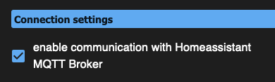

the IP address of HA installation must be filled in, the other settings should work with their defaults.

You can use the initial HA user or you can use another user for the MQTT connection.
The user which is entered "HA MQTT Authentication settings" must match the HA MQTT configuration.

# HA MQTT setup

if you not have the MQTT Server installed, do so by navigating Settings > Add-ons 

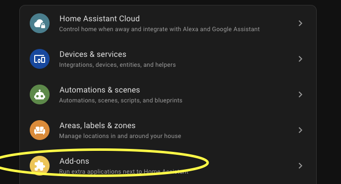

use mosquitto broker
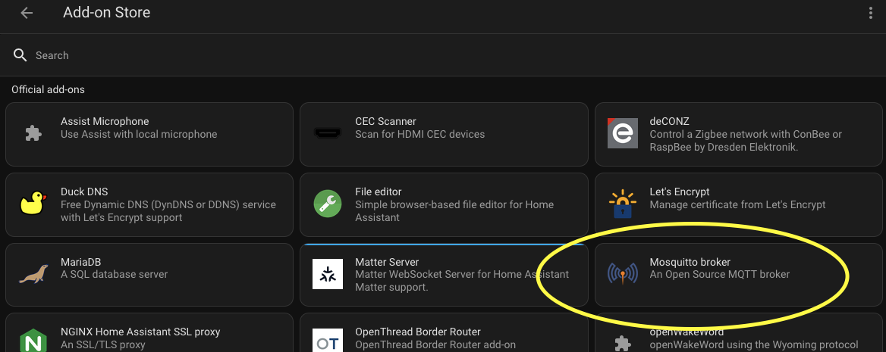

Note: Add-on avalability https://www.home-assistant.io/addons/

Install the MQTT broker add-on and Start it.

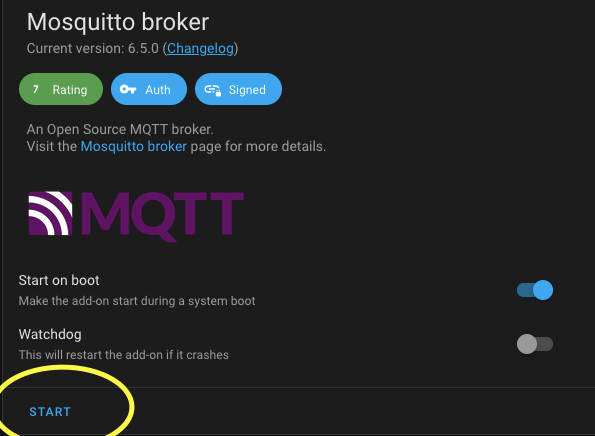

Install the MQTT integration through Settings > Devices & services

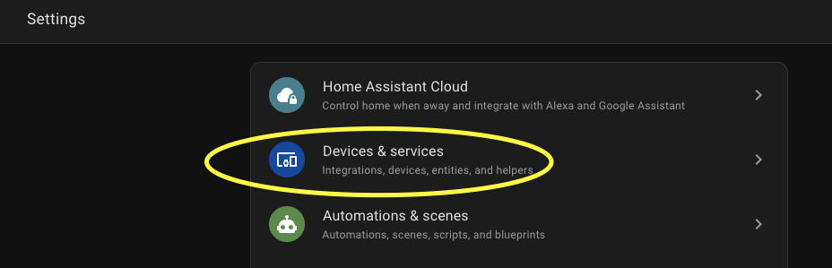

add the instance

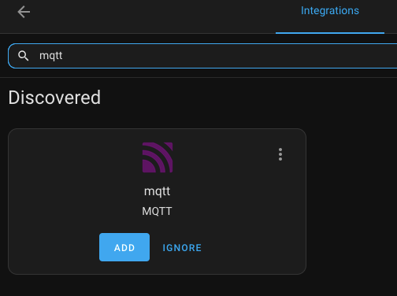

acknowledge the connection to the mqtt broker

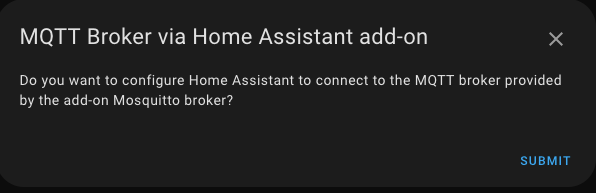

if ioBroker adapter is running and connected you see:

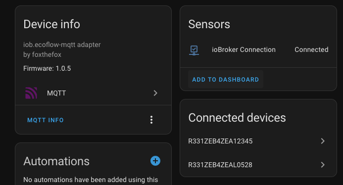

you can navigate to the devices

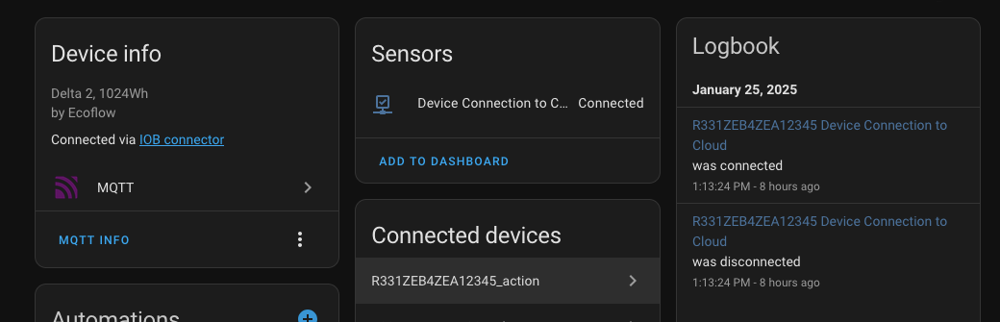

